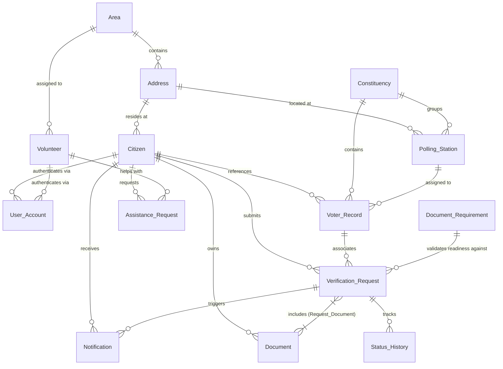

# SIRAssist – Entity Relationship (ER) Diagram Specification

## 1. Overview
SIRAssist is a relational database management system designed to assist citizens in preparing, tracking, and managing their document verification requests during electoral roll revision processes.

## 2. Entities and Attributes

| Entity | Primary Key | Attributes | Foreign Keys |
| :--- | :--- | :--- | :--- |
| **Address** | `address_id` | house_number, street, village, taluk, district, state, pin_code | None |
| **Area** | `area_id` | name, taluk, district, state, pin_code | None |
| **Citizen** | `citizen_id` | name, date_of_birth, gender, mobile, email, created_at | `address_id` -> Address |
| **Volunteer** | `volunteer_id` | name, mobile, email, availability, skills, verification_status, created_at | `area_id` -> Area |
| **User_Account** | `user_id` | username, email, password_hash, role, active, created_at | `citizen_id` -> Citizen, `volunteer_id` -> Volunteer |
| **Constituency** | `constituency_id` | name, district, state | None |
| **Polling_Station** | `polling_station_id` | station_name | `address_id` -> Address, `constituency_id` -> Constituency |
| **Voter_Record** | `voter_id` | epic_reference, record_status, last_checked_at | `citizen_id` -> Citizen, `constituency_id` -> Constituency, `polling_station_id` -> Polling_Station |
| **Document_Requirement** | `requirement_id` | request_type, document_type, mandatory, description, source_reference, active | None |
| **Document** | `document_id` | document_type, document_reference_masked, issue_date, verification_status, uploaded_at | `citizen_id` -> Citizen |
| **Verification_Request** | `request_id` | request_type, submission_date, current_status, remarks, created_at, updated_at | `citizen_id` -> Citizen, `voter_id` -> Voter_Record |
| **Request_Document** | (`request_id`, `document_id`) | submitted_at | `request_id` -> Verification_Request, `document_id` -> Document |
| **Status_History** | `history_id` | old_status, new_status, changed_by, changed_at, remarks | `request_id` -> Verification_Request |
| **Assistance_Request** | `assistance_id` | request_type, request_date, status, priority, notes, assigned_at, completed_at | `citizen_id` -> Citizen, `volunteer_id` -> Volunteer |
| **Notification** | `notification_id` | message, created_at, read_status | `citizen_id` -> Citizen, `request_id` -> Verification_Request |

## 3. Cardinality & Relationship Breakdown

1. **Address to Citizen (1 : N)**: One physical address can be shared by multiple citizens (e.g. family members living in the same house).
2. **Citizen to Voter_Record (1 : N)**: A citizen can have reference voter records in the system.
3. **Constituency to Voter_Record (1 : N)**: A constituency contains multiple voter records.
4. **Polling_Station to Voter_Record (1 : N)**: A polling station serves multiple voter records.
5. **Citizen to Document (1 : N)**: A citizen can upload multiple document references.
6. **Citizen to Verification_Request (1 : N)**: A citizen can log multiple verification requests.
7. **Verification_Request to Document (N : M)**: Resolving a request may require multiple documents, and a single document (e.g. Aadhaar) can be attached to multiple verification requests over time. Implemented via junction table `Request_Document`.
8. **Verification_Request to Status_History (1 : N)**: Every request records audit state changes over time.
9. **Citizen to Assistance_Request (1 : N)**: A citizen can ask for volunteer help multiple times.
10. **Volunteer to Assistance_Request (1 : N)**: A volunteer can accept and assist multiple citizens.
11. **Area to Volunteer (1 : N)**: A geographic area contains multiple registered volunteers.
12. **Verification_Request to Notification (1 : N)**: Status transitions trigger automatic notifications sent to citizens.
